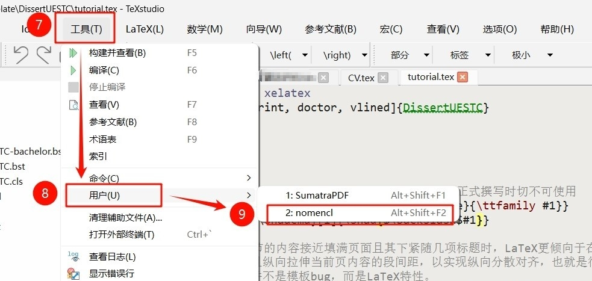

[简体中文](./readme.md) | **English**

<h1 align="center"> A LaTeX Template for Dissertation Writing at the University of Electronic Science and Technology of China Since 2024 </h1>
<div align="center">
  <a href="https://www.latex-project.org/lppl/">
    
  </a>
  <a href="https://github.com/MGG1996/DissertationUESTC/stargazers">
    
  </a>
  <a href="https://github.com/MGG1996/DissertationUESTC/forks">
    
  </a>
  <a href="https://github.com/MGG1996/DissertationUESTC/issues">
    
  </a>
</div>
<div align="center">
  <a href="https://github.com/MGG1996/DissertationUESTC/releases">
    
  </a>
  <a href="https://github.com/MGG1996/DissertationUESTC/releases/latest">
    
  </a>
</div>


- [1. Preface](#1-preface)
  - [1.1 Target Students](#11-target-students)
  - [1.2 Usage Environment](#12-usage-environment)
  - [1.3 Template Completion Degree](#13-template-completion-degree)
  - [1.4 How to Update the Template](#14-how-to-update-the-template)
  - [1.5 Reasons for Developing this Template](#15-reasons-for-developing-this-template)
  - [1.6 Credits](#16-credits)
  - [1.7 Disclaimers](#17-disclaimers)
  - [1.8 Statistics](#18-statistics)
- [2. Preamble of the Template](#2-preamble-of-the-template)
- [3. Thesis Cover and Title Page](#3-thesis-cover-and-title-page)
  - [3.1 Confidentiality Mark (2025.01.07)](#31-confidentiality-mark-20250107)
  - [3.2 Cover](#32-cover)
    - [3.2.1 Cover of Thesis Other Than "Double Degree Bachelor"](#321-cover-of-thesis-other-than-double-degree-bachelor)
    - [3.2.2 Cover of "Double Degree Bachelor" Thesis](#322-cover-of-double-degree-bachelor-thesis)
  - [3.3 Chinese Title Page (Graduate Students only)](#33-chinese-title-page-graduate-students-only)
  - [3.4 English Title Page (Graduate Students only)](#34-english-title-page-graduate-students-only)
- [4. Declaration of Originality (Graduate Students only)](#4-declaration-of-originality-graduate-students-only)
- [5. Chinese and English Abstracts](#5-chinese-and-english-abstracts)
- [6. Table of Contents, List of Figures, List of Tables, List of Symbols, Table of Abbreviations](#6-table-of-contents-list-of-figures-list-of-tables-list-of-symbols-table-of-abbreviations)
- [7. Main Body of the Thesis](#7-main-body-of-the-thesis)
  - [7.1 Write at the Beginning (2025.01.07)](#71-write-at-the-beginning-20250107)
  - [7.2 Titles at all Levels](#72-titles-at-all-levels)
  - [7.3 Figures](#73-figures)
  - [7.4 Tables](#74-tables)
    - [7.4.1 Ordinary Tables](#741-ordinary-tables)
    - [7.4.2 Tables with Notes](#742-tables-with-notes)
    - [7.4.3 Cross-page Tables](#743-cross-page-tables)
    - [7.4.4 Cross-page Tables with Notes (2025.01.05)](#744-cross-page-tables-with-notes-20250105)
  - [7.5 Pseudocode](#75-pseudocode)
  - [7.6 Definition, Axiom, Theorem, Proposition, Corollary, Lemma, Example, Assumption, Proof](#76-definition-axiom-theorem-proposition-corollary-lemma-example-assumption-proof)
  - [7.7 Footnote](#77-footnote)
  - [7.8 Various Numbers in the Template](#78-various-numbers-in-the-template)
  - [7.9 Typesetting and Fine-tuning Mathematical Formulas](#79-typesetting-and-fine-tuning-mathematical-formulas)
  - [7.10 Typesetting Mathematical Symbols in Titles](#710-typesetting-mathematical-symbols-in-titles)
  - [7.11 Typesetting Chemical Equations](#711-typesetting-chemical-equations)
  - [7.12 Cite](#712-cite)
- [8. Acknowledgement](#8-acknowledgement)
- [9. References](#9-references)
- [10. Appendix](#10-appendix)
- [11. Achievements Obtained During the Study for the Degree (Gradulate Students only in Principle)](#11-achievements-obtained-during-the-study-for-the-degree-gradulate-students-only-in-principle)
- [12. Original Foreign Language Materials (Undergraduate Students only)](#12-original-foreign-language-materials-undergraduate-students-only)
- [13. Translation of Foreign Language Materials (Undergraduate Students only)](#13-translation-of-foreign-language-materials-undergraduate-students-only)


## 1. Preface

### 1.1 Target Students

This template is developed based on:
* [研究生学位论文撰写规范（Final revision: 2024.01.17）](https://gr.uestc.edu.cn/xiazai/114/3917)
* [关于启动2021级本科毕业设计（论文）工作的通知（Release date: 2024.10.09）](https://www.sice.uestc.edu.cn/info/1140/14689.htm)
* [交叉复合型毕业设计（Release date: 2022.03.25）](https://www.jwc.uestc.edu.cn/info/1507170256521551874)

and is targeted for: 
> :white_check_mark: Academic Doctor :mortar_board: , Professional Doctor :mortar_board:
> 
> :white_check_mark: Academic Master :mortar_board: , Professional Master :mortar_board:
> 
> :white_check_mark: General Bachelor :mortar_board: , **Double Degree Bachelor（2025.04.21 added）** :mortar_board:
> 
> :white_check_mark: **International Students（2025.01.07 added）** :mortar_board:

Users should possess basic LaTeX typesetting skills to work with this template. This document does not cover the usage of common LaTeX commands and environments. For complete beginners, I recommend first reviewing [The Not So Short Introduction to LATEX2ε](https://ctan.math.utah.edu/ctan/tex-archive/info/lshort/english/lshort.pdf)，which will give you the basic understanding needed to comfortably work with the template.

Additionally, sections explicitly labeled as "**Bachelor only**", "**Graduate Students only**", or "**Professional Degree Students only**" in this document and the `tutorial.tex` example file should be used exclusively by the respective students. You must comment out or delete any content that does not apply to your specific degree.


### 1.2 Usage Environment

The development and testing environment for this template is `TeXLive2024 + TeXstudio` and `TeXLive2024 + VSCode`, **compatible with mainstream platforms such as Windows, MacOS, and Overleaf.** :clap:

:warning: Local users must update their LaTeX environment to [TeXLive2024 or above](https://mirrors.tuna.tsinghua.edu.cn/tex-historic-archive/systems/texlive/) or [MacTeX2024 or above](https://mirrors.tuna.tsinghua.edu.cn/tex-historic-archive/systems/mactex/) to avoid compatibility issues.

* [:link: TeXLive installation tutorial](https://zhuanlan.zhihu.com/p/389394015), [:link: MacTeX installation tutorial](https://blog.csdn.net/ChrisP_333/article/details/82943508)
* [:link: TeXstudio download](https://texstudio.sourceforge.net/#download), [:link: VSCode download](https://code.visualstudio.com/Download), [:link: VSCode configurations for LaTeX](https://zhuanlan.zhihu.com/p/166523064)

:warning: The template needs to be compiled using the `XeLaTeX` engine:

* If using the TeXstudio editor, no additional settings are required: the `tutorial.tex` file has set `% !TEX Program = xelatex` on the first line, which specifies that the document is compiled using the `XeLaTeX` engine.
* The above command is not recognized by the VSCode editor and Overleaf, so you need to set the compilation engine to `XeLaTeX` yourself.

In order to ensure that it compiles exactly the same on Windows, macOS, Overleaf, etc., the template has all the font files used built-in, which results in a project size that exceeds Overleaf's limit for uploading zip archives. Therefore, Overleaf users need to do another operation: :bulb: **First, create a new empty project on Overleaf, then unzip this template and drag and drop files and folders into the newly created project**.


### 1.3 Template Completion Degree

The template has implemented almost all the formatting requirements in the thesis writing standards, with only two features that have not been implemented and there are no plans at the moment :sweat_smile:: 

:anger: The implementation of typesetting figure notes below captions remains unrealized, primarily because no appropriate LaTeX package was identified, and my current technical capabilities are insufficient to devise a solution. :bulb: The alternative is to use footnotes, which are coordinated through `\footnotemark` and `\footnotetext`, as detailed in [LaTeX footnote commands](https://www.overleaf.com/learn/latex/Footnotes "\footnotemark coordinates with \footnotetext"). Or, simply avoid the use of notes in the figures and explain them in the text instead.

:anger: The pseudocode environment does not support typesetting across pages. The macro package used for typesetting pseudocode in this template is [algorithm2e](https://mirrors.sustech.edu.cn/CTAN/macros/latex/contrib/algorithm2e/doc/algorithm2e.pdf), which cannot typeset pseudocode across pages. :bulb: Typically, pseudocode across pages makes it more difficult to read. Instead, it may be more appropriate to split it into several sub-algorithms or sub-processes based on the algorithmic logic, typeset them separately, and then summarize thems.

In addition, it cannot be ruled out that there may be some omissions in the details of the template. If you find or encounter any problems, please feel free to come to :bug: [Project Issue Page](https://github.com/MGG1996/DissertationUESTC/issues) :bug: and raise feedbacks. If it is indeed a template issue, I will try my best to fix and update it in my spare time. :sparkles: Before that, students who use this template (especially those who inherit it from seniors) should come first and come often to :gift: [Project Release Page](https://github.com/MGG1996/DissertationUESTC) :gift: to take a look and make sure you are using the latest version. :satisfied:


### 1.4 How to Update the Template

:bulb: The correct way to update your template is to download the latest complete `.zip` file, extract it, and replace the original files and directories with your own `.bib` and `.tex` files, as well as the `fig` directory in the template.

:+1: The more recommended update method is: **<font color=#8b0000>when using this template for the first time, modify the file names of the `.tex` and `.bib` files (don't forget the `.bib` file name set by `\bibliography{}` in the `.tex` file). Subsequently, just download the latest template and copy all its contents to the directory where your thesis is located to replace it</font>**.


### 1.5 Reasons for Developing this Template

It has been several years since **Wang Wen** published his [thesisuestc](https://github.com/bdebye/thesisuestc), and the school's writing standards have been adjusted from time to time. For example, in the cover page and title page, although the layout structure of the [thesisuestc](https://github.com/bdebye/thesisuestc) is generally consistent with the new standards, the relative distance and size of some page elements are quite different from the new standards. **My original intention was to design a corresponding LaTeX template according to the latest writing standards, rather than copying [thesisuestc](https://github.com/bdebye/thesisuestc)**.

More importantly, this template hopes to provide :sparkles: **more complete content typesetting capabilities** :sparkles: and :sparkles: **more user-friendly functions** :sparkles: to reduce the energy consumption of users:

1. This template provides a printing mode. This mode will automatically insert blank pages at the necessary positions before the main body of the thesis according to the school's printing specifications, eliminating the need for manual processing of the compiled document and completely avoiding errors.

2. This template provides a review mode. It removes all identifying information, including supervisor information, as well as signatures and dates in the declaration of Originality, for easy review.

3. This template provides a duplicate checking mode. This mode will replace all figures in the compiled document with rectangular frames of equal size to ensure data security as much as possible when checking for duplicates.

4. This template can explicitly remind users of page exceedings. The specification sets limits on the length of the "Chinese Abstract" and "Acknowledgments". When these contents exceed the corresponding length limits, the template will print a message to remind users.

5. In the "Cover" and "English Title Page", this template can automatically determine the number of underlines to be generated based on the actual length of the input content, and is highly flexible and adaptable.

6. In addition to necessary pre-content such as "Chinese and English Abstract" and "Table of Contents", this template also provides complete optional pre-content such as "List of Figures", "List of Tables", "List of Main Symbols", and "List of Abbreviations".

7.  This template provides more powerful table typesetting capabilities and supports typesetting "cross-page tables with notes". The template encapsulates an additional pseudocode environment, allowing users to flexibly adjust the left and right indents of the pseudocode area according to actual conditions.

8. This template supports semi-automatic generation of increasing sub-formula numbers such as `(1-1a)`. This number is common in the constraints of mathematical models. Although the `\tag{}` command can be used to display the number of a specified constraint, this method is cumbersome to operate and it is easy to miss the tag when replacing or adding or deleting constraints, resulting in confusion in the sub-formula numbers. This template can completely avoid this situation.

9. This template optimizes the processing logic of `.bst` files. It can automatically determine the maximum length of the reference number, thereby adjusting the hanging indent distance of the reference entries to ensure a neat left margin of the Reference List.

10. This template uses LaTeX style to write `.cls` files as much as possible, which makes the content easier to understand. At the same time, a large number of detailed comments are retained in the file, which is more friendly to users with special needs or who need to fine-tune the template.


### 1.6 Credits

I am very grateful to senior **Wang Wen** for designing [thesisuestc](https://github.com/bdebye/thesisuestc), which has always been the first choice for UESTC graduates to write their degree theses. Because of this template, I came up with the idea of ​​designing my own degree thesis template and put it into action. In the process of designing the template, I also borrowed some of the design ideas of senior **Wang Wen**. It is really standing on the shoulders of predecessors that I have iterated my template to the current level after stumbling.

In addition, I would like to thank all the netizens for sharing their LaTeX knowledge on various websites (StackExchange, Zhihu, CSDN, cnblogs, etc.). With my own ability alone, it would be difficult and time-consuming to design a comprehensive LaTeX template.


### 1.7 Disclaimers

:warning: All the pictures used as examples in the `tutorial.tex` file are from the Internet. If there is any infringement, please contact me to delete them.

:warning: In addition, for the versatility of all platforms, the template has some necessary fonts built in. Although some fonts are already installed in the Windows system, they are not commercially available. Users of this template need to pay attention to this issue.


### 1.8 Statistics

[](https://www.star-history.com/#MGG1996/DissertationUESTC&bdebye/thesisuestc&shifujun/UESTCthesis&Date)


## 2. Preamble of the Template

The template's preamble area has only two lines:
1. `% !TEX Program = xelatex`: In the TeXstudio editor, it specifies that the document should be compiled using `XeLaTeX` engine. For other editors, you may need to manually set the compilation engine to `XeLaTeX`.

2. `\documentclass[<options>]{DissertUESTC}`: Indicates loading a document class named `DissertUESTC`, which is based on the LaTeX `book` class. This document class can accept **eight kinds** of options:

   1. `print`/`nonprint`: This option controls whether to generate the document in printing mode. Printing mode will automatically add necessary blank pages to the front of the thesis. The default is `nonprint`.

   2. `doctor`/`prodoctor`/`intdoctor`/`ipdoctor`/`master`/`promaster`/`intmaster`/`ipmaster`/`bachelor`/`doublebachelor`: This option sets the type of thesis, and the corresponding relationships are shown below. The default value is `doctor`.
      |Option|Corresponding Degree Type|
      |---|---|
      |`doctor`|Academic Doctor|
      |`prodoctor`|Professional Doctor|
      |`intdoctor`|International Doctor with Academic Degree|
      |`ipdoctor`|International Doctor with Professional Degree|
      |`master`|Academic Master|
      |`promaster`|Professional Master|
      |`intmaster`|International Master with Academic Degree|
      |`ipmaster`|International Master with Professional Degree|
      |`bachelor`|Bachelor|
      |`doublebachelor`|Double Degree Bachelor|
   
   3. [**Added**]`subfigsimple`/`subfigparens`: This option is used to adjust the numbering style generated for subfigure labels. The corresponding style for `subfigsimple` is `1-1a`, and the corresponding style for `subfigparens` is `1-1(a)`. The default is `subfigparens`.
   
   4. [**Added**]`draftfig`: The `draft` option provided by the LaTeX standard document class will not generate cross-reference links, hyperlinks, or bookmarks when typesetting the draft. Images will also be replaced with boxes + text of the same size, and thick borders will be marked where they exceed the table and page boundaries. The `draftfig` option only replaces images with boxes + text, without modifying other content involved in the standard `draft` option. The purpose of this option is to hide important experimental results data when checking for plagiarism, while not changing the overall layout of the paper.
   
   5. [**Added**]`review`: This option will typeset the "Cover" and "Chinese and English title page" in review mode, and all personal identifying information will be hidden, including supervisor information and the signature and date in the originality declaration. Of course, you can also hide the corresponding information by setting an empty parameter, but the `review` option can achieve the same effect without adjusting the command parameter content.
   
      In addition, the template supports extending the scope of `review` to other content. For example, if you need to erase personal identity information in "Acknowledgements" and "Achievements" before submitting for review, you can put the corresponding content in the `\ifreview[<replacement text>]{<original content>}` command. If the first optional parameter of the command is not specified, the `review` option will replace the original content with a two-word horizontal space; otherwise, the `review` option will replace the original content with the replacement text. (2025.03.06)
   
   6. [**Added**]`noreminder`: By default, when the length of the "Chinese Abstract" and "Acknowledgements" exceeds the maximum page limit of the specification, the template (after two compilations) will explicitly print a reminder message at the end of the corresponding content. If the user still wants to keep these contents after they are informed that the length exceeds the specification limit, the `noreminder` option can be used to disable the reminder message. (2025.02.22)
   
   7. [**Added**]`cmmmath`/`timesmathnogreek`/`timesmath`: This option is used to select the font used to render formulas. `cmmmath` corresponds to Computer Modern Math, which is the default font used by LaTeX and is also the default value for this type of option; `timesmathnogreek` specifies the use of Times New Roman to render English letters and numbers in formulas, but does not affect Greek letters, handwriting, and double-line fonts; `timesmath` continues to set Greek letters to Times New Roman (I personally feel that this font is a bit inconsistent with Greek characters), and handwriting and double-line fonts remain the same.
     
      Users who want to use Times New Roman fonts for all formulas can use the `timesmath` option. The latter two options are based on the [mathspec](https://mirrors.pku.edu.cn/ctan/macros/xetex/latex/mathspec/mathspec.pdf) macro package. In my limited testing practice, only it can achieve Times New Roman in the true sense. (2025.01.31)

      :exclamation: It should be noted that Times New Roman font does not support bold italic typesetting in formulas, so the last two options will invalidate the `\boldsymbol{}` command. To solve this problem, the template (only under the last two options) roughly redefines this command so that it can generate bold italic symbols like the original version. However, due to my lack of technical skills, the redefined `\boldsymbol{}` command needs to follow an additional usage rule: **its input parameter must be the most original mathematical symbol**. For example, if you want to typeset `\boldsymbol{\hat{\alpha}}`, which is no problem under `cmmmath`, then the correct source code should be `\hat{\boldsymbol{\alpha}}`, that is, put `\boldsymbol{}` in the innermost nesting. Otherwise, the template will either fail to render the expected mathematical symbols (under the `timesmath` option) or directly report the error `! Internal error: bad native font flag in 'map_char_to_glyph'` (under the `timesmathnogreek` option). It may involve some underlying problems, which I don't understand and cannot solve.
     
      :exclamation: Because of the characteristics of the [mathspec](https://mirrors.pku.edu.cn/ctan/macros/xetex/latex/mathspec/mathspec.pdf) macro package itself, using Times New Roman as the formula font requires more effort. For example, if you want to typeset `$f^t$`, you will find that the space between `f` and `t` is very small and the two overlap. At this time, you need to manually insert a space with `"`, that is, `$f^{"t}$`. Therefore, both the `timesmathnogreek` and `timesmath` options have similar flaws. Please carefully read the [mathspec](https://mirrors.pku.edu.cn/ctan/macros/xetex/latex/mathspec/mathspec.pdf) macro package documentation.
     
      :four_leaf_clover: In fact, the specification does not impose mandatory requirements on the font of formulas. Even if the format review system recognizes that the font of the formula is not Times New Roman, it will only throw a reminder instead of an error, and will not cause the format review to fail. It’s just that too many people ask why the font of the formula is not Times New Roman. Since some students like Times New Roman, this template adheres to the principle of inclusiveness and gives the user the right to choose.

   8. Alternatively, the `vlined` and `boxruled` options of the [algorithm2e](https://mirrors.sustech.edu.cn/CTAN/macros/latex/contrib/algorithm2e/doc/algorithm2e.pdf) package can be set when loading the document class.

## 3. Thesis Cover and Title Page

This part mainly fills in the content of the thesis cover and title page through the various commands provided by the template.

When submitting for review, you only need to leave the corresponding command parameters in this section blank to generate a cover and title page with empty positions. :warning: **<font color=#8b0000>Note that leaving the parameters blank means `{}`, not completely deleting them</font>**.

Of course, **a more convenient way is to use the `review` option of the document class**, which can hide personal identity information without adjusting the command parameter settings. If you want to hide other information, you need to leave the corresponding parameter blank. (2024.12.15)

### 3.1 Confidentiality Mark (2025.01.07)

For confidential thesis, you can use the `\setconfidential(<the distance between the upper right corner of the information and the left and upper borders of the page, separated by commas>)[<font format>]{<classification level>}{<confidentiality period>}` command provided by the template to generate confidential information on the cover.

This command provides two optional parameters to adjust the placement and font format of this information when necessary. The default values ​​are `18cm,2cm` and `\zihao{4}\bfseries`. This command must be used before the `\uestccover` command to take effect.

:warning: **<font color=#8b0000>Use confidentiality labels with caution!!! Students should not arbitrarily classify their theses as confidential</font>**, and they must obtain relevant approval.

### 3.2 Cover

To generate a correct thesis cover, you must first specify the corresponding `doctor`/`prodoctor`/`intdoctor`/`ipdoctor`/`master`/`promaster`/`intmaster`/`ipmaster`/`bachelor`/`doublebachelor` options correctly in the document class.

#### 3.2.1 Cover of Thesis Other Than "Double Degree Bachelor"

The command used to generate these thesis covers is: `\uestccover[<school name layout style>]{<thesis title>}{<discipline>}{<student number>}{<author name>}{<supervisor>}{<teacher title>}{<school>}`.

According to feedback, the full names of some schools are too long, which will cause the `School Name` on the cover to overlap with the wording in front. In response to this problem, this template has readjusted the part of the `School Name` in `\uestccover` (2024.12.10). Currently, the command scales the **overly long** school names to fit the corresponding underscores by default. In addition, the command adds an optional parameter `<school name layout style>`, and the parameter value can only be set to `par`. At this time, the command will no longer scale the school name but let it automatically wrap:

* For the Graduate cover, the `School` has already touched the bottom edge of the page. In order to allow the overly long school name to wrap smoothly without squeezing the bottom edge, **the `par` option will borrow part of the vertical spacing between the last line of the `Thesis Title` and `Discipline`**. In other words, to maintain the standard page margins, the above vertical spacing has to be reduced, which is unavoidable.

* For the Bachelor cover, the `School` follows the `Thesis Title`. Under the two-line school name, the vertical spacing between the two is also reduced. The specific results can be seen in the layout examples given in the `tutorial.pdf` document.

Remember, :warning: **only supports two lines at most**. If there are really schools with names longer than two lines in UESTC, I'm sorry, this template cannot generate a perfect cover for you. Especially for bachelor theses, school names with three or more lines will definitely overlap with the content below; and for graduate theses, although there is no problem of overlapping with the text below, the last line of the school name will definitely break through the page boundary, causing the entire page to look inconsistent from top to bottom. For such users, if you are willing to use this template to write other content, you can finally use the official Word document provided by UESTC to generate the thesis cover, and then replace it. Apart from this, I can't think of any other more convenient and less error-prone solutions. (2024.12.10)

:exclamation: Note: **The order of the parameters in the `\uestccover` command is designed based on the cover page of a graduate thesis. The content layout of a bachelor thesis cover page is different**. **<font color=#8b0000>Bachelors must fill in the order required by the command, rather than looking at the cover page sample pdf</font>**.

#### 3.2.2 Cover of "Double Degree Bachelor" Thesis

To generate a thesis cover for the Double Degree Bachelor, use: `\uestccover{<thesis title>}{<school>}{<first major>}{<second major>}{<student number>}{<author name>}{<first supervisor and title>}{<second supervisor and title>}`. (2025.04.21)

:exclamation: **Note that the above command is different from the definition used by other paper types. <font color=#8b0000>There are 8 mandatory parameters, no optional parameters, and the order and meaning of the parameters are also different</font>.** Please use it carefully.

### 3.3 Chinese Title Page (Graduate Students only)

There is too much content to fill in the `Chinese Title Page`, which exceeds the limit of 9 parameters supported by LaTeX commands, so you need to set various macros first:

1. `\ClsNum{<classification number>}`;
2. `\ClsLv{<classification level>}`;
3. `\UDC{<UDC number>}`;
4. `\DissertationTitle{<thesis title>}`;
5. `\Author{<author name>}`;
6. `\Supervisor{<supervisor>}{<title>}{<institution>}{<address>}`;
7. `\AssociateSupervisor{<associate supervisor>}{<title>}{<institution>}{<address>}`: Set the associate supervisor information, if there is none, just comment;
8. `\DegLv{<degree level>}`: This information is automatically determined by the document class options and is used when the default content needs to be modified, otherwise it can be commented out;
9. `\Major{<discipline>}`;
10. `\Profield{<professional degree field code>}`: <font color=#8b0000>This is unique to professional degrees</font>, and academic degree users can just comment it;
11. `\Date{<submission date>}{<defense date>}`;
12. `\Grant{<degree-granting institution>}{<degree-granting date>}`;
13. `\Reviewer{<chairman of the defense committee>}{<reviewers>}`;

Then use `\uestczhtitlepage` to generate the `Chinese Title Page`.

The `\uestczhtitlepage` command can accept an optional parameter `[compress]`. By default (that is, the optional parameter is not specified, or is specified as other content), if you encounter an extra-long `Supervisor Title`, such as "教授级高级工程师", this template will typeset it with its actual length, while keeping the other content in its column aligned to the left. This means that the actual length of the `Supervisor Title` must exceed the `3.25cm` set by the official specification. Although I personally think there is nothing wrong with doing so, I am not sure whether it is compliant. For this reason, the template provides the `[compress]` optional parameter for the `\uestczhtitlepage` command. After setting this parameter, supervisor titles longer than `3.25cm` will be automatically compressed to strictly adapt to the length reserved by UESTC for the content. For the actual effect, see the compilation result of `tutorial.tex`. It's up to you to choose. (2025.03.04)

### 3.4 English Title Page (Graduate Students only)

To generate an `English Title Page`, use the command: `\uestcentitlepage{<theiss title>}{<major>}{<student number>}{<author>}{<supervisor>}{<associate supervisor>}{<school>}`. If there is no associate supervisor, leave the `<associate supervisor>` parameter as blank `{}`.


## 4. Declaration of Originality (Graduate Students only)

To generate a declaration of originality, use the command: `\declaration[<signature width>]{<date>}{<author signature image 1 file name>}[<author signature image 2 file name>]{<supervisor signature image file name>}`. 

* The optional parameter `<signature width>` can adjust the display width of the signature image;
* The optional parameter `<author signature image 2 file name>` is used to set an independent signature image for the second author's signature in the originality declaration, which is distinguished from the first signature in handwriting, thereby simulating the effect of a handwritten signature. If this optional parameter is not specified, its value is taken as `<author signature image 1 file name>`.

All signature images need to be placed in the `./fig/` subdirectory of the project directory.

The original intention of this command is to allow users to use electronic signatures on the originality declaration page to avoid the page being crooked after being scanned and replaced in the electronic file, which affects the appearance. :exclamation: However, I heard that theses uploaded to the database must be signed by hand, but I don’t know if it is really so strict. If so, just leave all mandatory parameters blank `{}` to generate the original originality declaration page.

## 5. Chinese and English Abstracts

To generate a `Chinese Abstract`, you must first use `\zhabstract`, and then continue to append content. For `Chinese keywords`, use `\zhkeywords{<Chinese keywords>}`.

To generate a `English Abstract`, you must first use `\enabstract`, and then continue to append content. For `English keywords`, use `\enkeywords{<English keywords>}`.

## 6. Table of Contents, List of Figures, List of Tables, List of Symbols, Table of Abbreviations

Use the corresponding command at the corresponding position in the document:

1. Table of Contents: `\tableofcontents`;
2. List of Figures: `\listoffigures`;
3. List of Tables: `\listoftables`;
4. List of Symbols: `\listofsymbs` command + `symbtable` environment;
   * Use the `\listofsymbs` command to generate the chapter title of the symbol table at where it needs to be inserted;
   * Next, the `symbtable` environment is used to typeset the contents of the main symbol table. This environment is encapsulated based on the [`longtable`](https://mirrors.tuna.tsinghua.edu.cn/CTAN/macros/latex/required/tools/longtable.pdf) environment and accepts two optional parameters in turn: `\begin{symbtable}[<table position>](<column control parameters>)`。
     - The first optional parameter is used to set the optional parameters of the `longtable` environment, and its default value is consistent with the `longtable` environment;
     - The second optional parameter is used to set the required parameters of the `longtable` environment, and its default value is set to `p{3.5em} p{\linewidth-9em} p{3em}<{\centering}`.

    The optional parameters of the `symbtable` environment should not be specified unless necessary. However, for the sake of typographical aesthetics, the width of the columns of the symbol table can be adjusted appropriately. :warning: Note that according to the examples in the thesis writing guidelines, **<font color=#8b0000>the symbol table has and only has three columns</font>**. Therefore, do not set a different number of columns for the second optional parameter.
5. Typesetting abbreviations is more complicated:
   * First use `\printnomenclature[<English abbreviation width>](<Chinese full name width>)`. The first optional parameter controls the column width of the **English Abbreviation**, which defaults to `5em`; the second optional parameter controls the column width of the **Chinese Full Name**, which defaults to `7.5em`.
   
   * Then, use the command `\nomchn[<sort prefix>]{<abbreviation>}{<English full name>}{<Chinese full name>}` to add the abbreviation entry at the location where the abbreviation appears in the text. It only needs to be added once. The `sort prefix` is ​​only used when there is a special sorting requirement for a specific entry. For details, refer to the parameter description of the `\nomenclature` command in the [nomencl](https://mirrors.hust.edu.cn/CTAN/macros/latex/contrib/nomencl/nomencl.pdf) macro package.

   * In addition, local users need to compile the auxiliary file that generates the abbreviation table first, and then compile the full document to get the expected results. For tutorials, see [Compiling the Acronym Table](https://zhuanlan.zhihu.com/p/46442713) or the **operation screenshot** below :point_down:. Overleaf users can do it with one click without additional operations.

        * :bulb: When using TeXstudio, configure the user command as shown in the figure below: `makeindex %.nlo -s nomencl.ist -o %.nls | txs:///compile | makeindex %.nlo -s nomencl.ist -o %.nls | txs:///compile`, then execute the command in the toolbar (once), and you no longer need to compile the entire document:
          <p align = "center">
          
          
          
          </p>

          If the abbreviation table is updated, you only need to execute steps 7, 8, and 9 above again without redefining the command.
        
        * :bulb: When using VSCode, you need to call out to the terminal and type the command: `makeindex %.nlo -s nomencl.ist -o %.nls`, execute (twice), and then compile the entire document:
          <p align = "center">
          
          </p>
          
          If the abbreviation list is updated, you need to type the above command in the terminal and execute it again, and then compile the entire document.


## 7. Main Body of the Thesis

### 7.1 Write at the Beginning (2025.01.07)

I have frequently received the same type of questions: 
* **Why is the paragraph spacing in the text too large?** 
* **Why is the space before the displayed formula too large?**

When the content of a section in the thesis is close to filling up the page and is followed by several titles, LaTeX tends to split the page before the subsequent titles and vertically stretch the paragraph spacing of the current page content to achieve vertical dispersed alignment, which is the phenomenon that many people are asking about. This is not a template bug, but a LaTeX feature.

The "culprit" that causes this situation is the content, which is common on pages with figures, tables, displayed formulas, and titles. Their height is likely not an integer multiple of the text line spacing, so it is more likely to cause this phenomenon.

If you prefer the way that MS Word stacks the content from top to bottom and leaves a noticeable gap at the end of the page, use the `\raggedbottom` command at the beginning of the document. As the name suggests, its function is to allow ragged bottoms, which is similar to the form of MS Word.

In addition, there should be no blank lines before the displayed formulas, and the `equation` environment will wrap itself. Adding blank lines will naturally increase the vertical spacing.


### 7.2 Titles at all Levels

This template is implemented based on the `book` class, so the chapter title needs to be generated using `\chapter{<chapter title>}`, and other levels of titles are `\section{<section title>}`, `\subsection{<subsection title>}`, and `\subsubsection{<grandchild section title>}`.

The specification requires that **<font color=#8b0000>when there is no text between two titles, the paragraph spacing of the second title should be set to 0 pounds</font>**. I have personally tested that LaTeX will automatically compress the vertical distance between consecutive titles, and the rule it adopts is to directly ignore the paragraph spacing of the lower title.

However, in actual use, sometimes the vertical spacing between consecutive titles is still large. This phenomenon is essentially due to the LaTeX typesetting characteristics mentioned in [Section 7.1](#71-write-at-the-beginning-20250107). By default (that is, without using `\raggedbottom`), when the actual content of a middle page does not fullfill the entire page area, LaTeX will evenly insert additional vertical space between the paragraphs of the page, so that the content of the entire page is vertically aligned to the upper and lower boundaries of the page. It is this feature that causes the vertical distance between consecutive titles to be too large in some cases.

Theoretically, the more content there is on the middle page and the more paragraphs there are, the closer LaTeX's layout results for consecutive titles will be to the standard requirements. If the vertical spacing between consecutive titles is too large due to insufficient page content or other reasons, the user needs to manually adjust it. The operation method is to use `\vspace*{}` to insert negative vertical distance between consecutive titles for compensation. The value of negative distance is not fixed and depends on the content of the page. Users need to try it themselves. `tutorial.tex` has provided relevant examples.

### 7.3 Figures

This template uses the [graphicx](https://mirror.nyist.edu.cn/CTAN/macros/latex/required/graphics/grfguide.pdf) and [subfig](https://mirrors.bfsu.edu.cn/CTAN/macros/latex/contrib/subfig/subfig.pdf) packages to process inserted figures and subfigures. Please refer to the source code in `tutorial.tex` for details.

The figure files to be typeset need to be placed in the project directory `./fig/`.

### 7.4 Tables

**Note**: Due to some implementation issues, for any table that is **determined to be non-bottom layout**, when the user specifies the optional layout mode through the table environment options, :warning: **<font color=#8b0000>do not provide the `b` mode</font>**, otherwise the top spacing of the table will be too narrow; conversely, for the first table **determined to be bottom layout** on a page, the user needs to :warning: **<font color=#8b0000>explicitly specify `b` or `!b` in the options</font>**, otherwise the top spacing of the table will be too wide.

If unexpected situations occur, users can adjust the upper and lower spacing by inserting `\vspace*{<length>}` after the start and before the end of the `table` environment to make it look coordinated.

#### 7.4.1 Ordinary Tables

There is no need to explain the layout of ordinary tables. You can use the `table` + `tabular` environment, but please note: the three lines in the three-line table need to use `\toprule`, `\midrule`, and `\bottomrule` respectively, so as to meet the requirements of the graduate standard for line thickness (`1.5` pounds, `0.75` pounds, and `1.5` pounds). Be careful **not to use `\hline`**. For undergraduates, the bachelor's degree thesis standard requires that the line thickness in the table be unified to `0.5` pounds. Therefore, under the bachelor and doublebachelor options, the line thickness of `\toprule`, `\midrule`, `\bottomrule`, and `\cmidrule` are all set to `0.5` pounds. (2025.05.01)

When you need to add horizontal borders to some cells in a table, you should use `\cmidrule[<line thickness>](<trim>){<start column-end column>}` <font color=#8b0000>instead of</font> `\cline{<start column-end column>}`. The latter does not seem to be able to adjust the line thickness or trim the endpoints of the border.

* The first optional parameter of the former allows users to set the border thickness, and its default value is set to `0.5` pounds for `bachelor` and `doublebachelor` options, and `0.75` pounds for other thesis types. Users do not need to set this optional parameter unless necessary;

* The second optional parameter allows the user to trim the endpoints of the borders, which is useful when you need to visually separate adjacent borders in the same row. For the possible values ​​of the second optional parameter, it is recommended that users refer to the official documentation of the [booktabs](https://mirrors.sustech.edu.cn/CTAN/macros/latex/contrib/booktabs/booktabs.pdf) macro package.

#### 7.4.2 Tables with Notes

What needs to be explained is how to generate a table with notes. This template uses the `threeparttable` environment provided by [threeparttable](https://mirrors.cqu.edu.cn/CTAN/macros/latex/contrib/threeparttable/threeparttable.pdf) macro package to layout the notes in the table at the bottom of the table:

1. Use `\tnote{<label>}` to insert superscript numbers in a table;
2. Use the `tablenotes` environment to typeset notes at the bottom of a table. This environment provides the option `online` for changing the numbering style before the note text from the default superscript style to the inline style.

:four_leaf_clover: The annotated table typesetted with the above method cannot jump to the corresponding note by clicking the number in the table. To this end, this template provides the commands `\puttablenotelabel{<label>}` and `\tablenoteref{<label>}` to achieve this operation (2025.01.05):

* First replace the manually set number in the `tablenotes` environment with `\puttablenotelabel{<label>}`;

* Then use `\tablenoteref{<label>}` at the corresponding position of the table content. The number will be automatically generated and incremented in the order of using `\puttablenotelabel`.

This method requires cross-references, so you usually have to compile twice. Remember, :warning: **<font color=#8b0000>labels must be unique throughout the document</font>**.

#### 7.4.3 Cross-page Tables

In principle, tables that are less than one page long should not span across pages. For tables that are longer than one page, this template uses the `longtable` environment provided by the [longtable](https://mirrors.tuna.tsinghua.edu.cn/CTAN/macros/latex/required/tools/longtable.pdf) macro package for typesetting. Users need to understand the basic usage of the `longtable` environment. The biggest difference between it and the `tabular` environment is that users need to define the table title, header, and footer after paging.

This template provides the command `\CPcaption{<total number of table columns>}{<table title>}` to correctly typeset the table title after page acrossing. **Please be sure to use this command**, otherwise the table title after page acrossing will use the same line and paragraph spacings as the table content, rather than being consistent with the format required by the specification; and when the length of the table title exceeds the table width, the expected typesetting result cannot be produced. (2025.01.05)

In addition, :warning: **<font color=#8b0000>The `longtable` environment should not be nested in a floating environment such as `table`</font>**, otherwise the long table will not span across pages normally.

For more details, refer to the corresponding source code in `tutorial.tex`.

#### 7.4.4 Cross-page Tables with Notes (2025.01.05)

To my limited knowledge, LaTeX does not seem to provide a macro package to implement this type of table. In desperation, this template provides a cumbersome but feasible approach.

The idea is to use the table footer customization function provided by `longtable` environment to insert notes, that is, the user needs to modify the settings of the table footer before `\endlastfoot` in `longtable`. To this end, the template provides the following commands:

`\tablenotetext(online)(<note number hanging distance>)[<vertical space above note>]{<total note width>}{<note label>}{<note content>}`

* The first optional parameter is marked with `()`, which only accepts the parameter `online`. It is used to change the note number from the default superscript form to the inline form, that is, to imitate the option of the `tablenotes` environment;
* The second optional parameter is only valid when the first optional parameter is set to `online`. It is used to adjust the hanging indent distance of the note number. The default is `1em`. When there are too many notes in the table, you can manually adjust this optional parameter to avoid overlapping of the long number with the following text;
* The third optional parameter is marked with `[]`. When the vertical distance between the generated note and the content above is not appropriate, you can manually adjust it through this optional parameter. The default value is `0bp`;
* The fourth mandatory parameter corresponds to the overall width of the note, and its value needs to be repeatedly adjusted according to the width of the table after layout, until the width of the note and the table footer are the same. This is indeed very cumbersome, but I am really limited in my ability and can't think of a better way. It is really difficult to automatically determine the actual width of the table;
* The fifth mandatory parameter is responsible for setting the label corresponding to the note number so that it can be referenced in the table using `\tablenoteref{}` later. <font color=#8b0000>The label also needs to be unique throughout the document</font>;
* The sixth mandatory parameter corresponds to the actual content of the note.

:warning: Note: The prerequisite for using the `\tablenotetext` command is to set the first column of the table specifically. The user **<font color=#8b0000>must manually set the width of the first column of the `longtable` through `p{<length>}` or `m{<length>}`, instead of `c`, `r`, or `l`</font>**. In addition, the last `\tablenotetext` in the table does not need `\\` followed, otherwise the space between the end of the table and the text below will be too large.

There may be an extreme case: a page break occurs at the beginning of a note when the table spans across pages, which will produce an unwanted typesetting result. To solve this problem, the user has to manually use the `\pagebreak` command provided by the [longtable](https://mirrors.tuna.tsinghua.edu.cn/CTAN/macros/latex/required/tools/longtable.pdf) macro package to break the page in advance at the appropriate position of the table content, at the cost of more blank space at the bottom of the previous page. If you are particularly unlucky, the note is particularly long, and a page break occurs in the middle of the note, then I really can't do anything. :scream: :scream: 。

:exclamation: I have to admit that the `\tablenotetext` command is very unstable. Its parameters need to be adjusted in different tables, and even in different layout settings of the same table. It can be said that each table has a different parameter. If you have to use it, you have to invest a lot of effort. Unfortunately, this is the limit of what I can do at present. :joy: :joy: 。

### 7.5 Pseudocode

The template typesets pseudocode based on the `algorithm` environment of the [algorithm2e](https://mirrors.sustech.edu.cn/CTAN/macros/latex/contrib/algorithm2e/doc/algorithm2e.pdf) macro package. By default, the left and right borders are not added. The top and bottom borders are bolded according to the `table` requirements in the specification. The font size is set to 5, which is consistent with the table. :bulb: To restore the left and right borders of the pseudocode, you can use the `boxruled` option when loading the document class. The pseudocode generated by this environment has the same width as the body text.

In addition to the various conditions and loop statements provided by the [algorithm2e](https://mirrors.sustech.edu.cn/CTAN/macros/latex/contrib/algorithm2e/doc/algorithm2e.pdf) macro package itself, this template adds `Do While` and `Loop` statements based on the interface provided by the macro package:
- `\DoWhile(<Text following the keyword 'do', it can be used to add comments>){<loop condition>}{<loop body>}`
- `\Loop(<Text following the keyword 'loop', it can be used to add comments>){<loop body>}`

In addition, based on the adjusted `algorithm` environment, the template further encapsulates the `algo` environment, which will generate a **narrower** pseudocode floating area than the `algorithm` environment. In addition to accepting the floating optional parameter `[htbp]`, the `algo` environment also supports another optional parameter `(<total distance of pseudocode from the text boundary>)`: This parameter controls the total distance of the floating body from the text boundary, the default is `4em`, that is, `2em` on one side, aligned with the first line of text below. The two optional parameters can be used separately or simultaneously, and **the order when used simultaneously must be consistent with the example below**.

```tex
\begin{algo}[<floating parameter>](<total distance of pseudocode from the text boundary>)
    .....
\end{algo}
```

### 7.6 Definition, Axiom, Theorem, Proposition, Corollary, Lemma, Example, Assumption, Proof

This template defines the environments for each of the above: `definition`, `axiom`, `theorem`, `proposition`, `corollary`, `lemma`, `example`, `assumption`, and `proof`。

### 7.7 Footnote

This template uses a font that includes circled numbers to replace the circled numbers drawn by LaTeX, providing a sufficient number of circled numbers while ensuring that the circled footnote numbers are elegant enough.

* In the main body, to insert a footnote, just use the `\footnote{<footnote content>}` command at the corresponding position;

* In other contexts, such as tables, users need to combine `\footnotemark` and `\footnotetext{<footnote text>}` commands to typeset footnotes:
   1. First, use `\footnotemark` where you want to insert the footnote number;
   2. Then, use `\footnotetext{<footnote text>}` outside the environment to specify the footnote content. For more detailed usage, refer to [LaTeX footnotes](https://blog.csdn.net/xovee/article/details/127563209 "\footnotemark+\footnotetext配合生成脚注").

### 7.8 Various Numbers in the Template

Document elements such as "title", "figure", "table", "algorithm", "equation", "definition", "axiom", "theorem", "proposition", "corollary", "lemma", "example", "assumption", "proof" and "footnote" can all be automatically calculated and numbered without the need for users to worry about it. However, **sub-formula numbers such as (1-1a) cannot be automatically generated**. For this reason, the template provides the `\subeqtag[<number label>]` command.

When creating numbers for constraints in a mathematical model, a common method is to directly specify the number content with the `\tag{}` command. However, this method is cumbersome to operate, and it is easy to miss some tags when you need to replace or add or delete constraints later, resulting in confusion in the sub-formula numbers, which is prone to be ingored.

The `\subeqtag[<number label>]` command provided by this template completely avoids the above problems. Users only need to insert `\subeqtag` after the corresponding constraint to give the constraint a sub-number that is consistent with the current main formula number. Moreover, using this command for multiple consecutive constraints will **automatically generate** increasing sub-formula numbers, and the numbers will be **automatically updated** when the constraint order is swapped, so there will be no mistakes.

If you need to refer to a sub-formula number in the text, you can use `\label{<number label>}` after `\subeqtag` as usual, or you can directly specify the optional parameter `\subeqtag[<sub-formula number label>]`, which is very user-friendly. For details, please refer to the examples given in `tutorial.tex`.

:pushpin: There are two points to remind you:
1. The optional parameter of `\subeqtag[<number label>]` cannot be dumplicated as it is essentially a call to `\label{<number label>}`.

2. Although `\subeqtag[<number label>]` calls `\label{<number label>}` to add labels, the TeXstudio editor does not pop up the options for these labels when using `\ref{<number label>}` or `\eqref{<number label>}`, and they need to be entered manually; while the labels specified directly with `\label{<number label>}` will appear in the option prompt when citing, and can be directly selected. This is the inconvenience of `\subeqtag[<number label>]` after accepting optional parameters, but unfortunately I don't know how to solve it. :sob: :sob:


### 7.9 Typesetting and Fine-tuning Mathematical Formulas

For users who are not familiar with the correspondence between mathematical symbols and LaTeX source code, please refer to the [LaTeX Formula Manual @樱花赞](https://www.cnblogs.com/1024th/p/11623258.html), and it will not be elaborated here.

When a mathematical model or a group of formulas containing many equations appears in the thesis, and the remaining layout space on the page cannot accommodate them completely, the user can use `\allowdisplaybreaks[<cross-page tendency>]` in the Preamable or at the beginning of the document to allow the group of formulas to be laid out across pages, thereby avoiding a large blank space at the bottom of the page. The optional parameters of this command can take values ​​of 1, 2, 3, and 4. The larger the value, the higher the tendency of laying out across pages.

When some formulas are too long to exceed the page boundary, users can nest `aligned` environment in `equation` environment to adjust them to multiple lines. In addition, if the part of the formula that exceeds the page boundary is not much, the length of the formula can be slightly compressed by adjusting the spacings between mathematical symbols in the formula through the three commands `\thinmuskip`, `\medmuskip`, and `\thickmuskip` within `equation` environment. The units of the three spacings can only be `mu`. The corresponding examples are given in `tutorial.tex`.


### 7.10 Typesetting Mathematical Symbols in Titles

Although I do not recommend typeset math symbols in titles (because the specification does not even recommend typeset English abbreviations in titles), if you must, you can use the `\texorpdfstring{<TeXstring>}{<PDFstring>}` command provided by the [hyperref](https://mirrors.tuna.tsinghua.edu.cn/CTAN/macros/latex/contrib/hyperref/doc/hyperref-doc.pdf) package (which has been loaded in the template). For details on how to use this command, please refer to: [How to use texorpdfstring](https://blog.csdn.net/qq_42679415/article/details/139592054). There are also corresponding usage examples in `tutorial.tex`.


### 7.11 Typesetting Chemical Equations

This template is based on the [mhchem](https://mirrors.cloud.tencent.com/CTAN/macros/latex/contrib/mhchem/mhchem.pdf) and [chemfig](https://mirrors.bfsu.edu.cn/CTAN/macros/generic/chemfig/chemfig-en.pdf) packages to typeset chemical equations, structural formulas, and bond lines. For the use of related commands, please refer to the official documentation of the macro package or [@codesonic's](https://www.luogu.com.cn/user/45443) article: [Writing Chemical Equations with LaTeX](https://www.luogu.com.cn/article/o7mlv3w8). `tutorial.tex` quotes some examples from the article for demonstration, thanks.


### 7.12 Cite

To cite numbers of "equation", "figure", "table", "algorithm", "definition", "axiom", "theorem", "proposition", "corollary", "lemma", "example", "assumption", and "proof", you can use `\ref{<label>}` directly. To generate formula numbers with brackets, use `\eqref{<label>}`.

If you want to fully cite the subfigure caption number, you can use `\ref{<label>}` directly. The `DissertUESTC` document class generates a full number in the form of `1-1(a)` by default, but if the user specifies the `subfigsimple` option of the document class, it will generate a full number in the form of `1-1a` (Note: The dissertation writing specification does not clearly state which format should be used to reference subfigure numbers, but I read a Chinese monograph that uses the `1-1(a)` format, so I set it as the default style). Conversely, if you want to cite the subfigure caption number separately (for example, add the subfigure caption text according to the subfigure number after the main figure title), you need to use `\subref{<label>}`, which will generate a separate number in the form of `(a)`.

For inline citations of references, use `\cite{<label>}` directly, and for superscripts, use `\citess{<label>}`.

References are cited based on the [natbib](https://mirrors.zju.edu.cn/CTAN/macros/latex/contrib/natbib/natbib.pdf) macro package, and multiple references can be cited at one time (i.e. `\cite{<label1, label2, label3>}` or `\citess{<label1, label2, label3>}`). These numbers will be sorted and compressed (if possible).

In addition, the graduate thesis specification requires that the formula numbering style used in citations should be in English brackets, i.e. `(1-1)`, while the undergraduate thesis specification requires that it be in Chinese brackets, i.e. `（1-1）`. As for the numbers on the right side of formulas, both use English brackets. This difference is completely controlled by the corresponding options (`doctor`/`prodoctor`/`intdoctor`/`ipdoctor`/`master`/`promaster`/`intmaster`/`ipmaster`/`bachelor`/`doublebachelor`), so be sure to set the correct options.

## 8. Acknowledgement

To generate an **Acknowledgment** chapter, use `\acknowledgement`, and then edit the content. This command is essentially a wrapper for `\chapter*{}`, supplemented with operations such as generating a ToC entry, a bookmark entry, and modifying the header.

## 9. References

This template implements the typesetting styles of 9 document types listed in the specification, including **"journal articles", "conference papers", "monographs", "dissertations", "newspaper articles", "reports", "authorized patents", "standards"**, and **"electronic documents"**.

The `.bib` database **entry identifiers** defined in this template for these document types are `article`、`inproceedings/conference`、`book`、`mastersthesis/phdthesis`、`news`、`report`、`patent`、`standard`、and `digital`, respectivlely.

Different document type entries contain different fields. The following lists the `.bib` database formats corresponding to some references used as examples in the [writing specifications for graduate degree theses](https://gr.uestc.edu.cn/xiazai/114/3917), covering the above 9 document types:

```bib
@book{教育部国家语言文字工作委员2018,
    author={教育部国家语言文字工作委员},
    title={通用规范汉字},
    address={北京},
    publisher={语文出版社},
    year={2018},
    language={schinese},
}
```

```bib
@standard{学位论文编写规范555,
    author={全国信息与文献标准化技术委员},
    title={学位论文编写规范},
    number={GB/T 7713.1-2006},
    address={北京},
    publisher={中国标准出版社},
    year={2007},
    pages={17-20},
}
```

```bib
@article{王晓琰2019关于连续出版会议论文著录格式的探讨,
    title={关于连续出版会议论文著录格式的探讨},
    author={王晓琰 and 殷建芳 and 王晓峰 and 邓迎 and 杨蕾},
    journal={学报编辑丛论},
    number={0},
    year={2019},
    pages={162-165},
    language={schinese},
}
```

```bib
@article{hu2014domain,
    title={Domain decomposition method based on integral equation for solution of scattering from very thin, conducting cavity},
    author={Hu, Jun and Zhao, Ran and Tian, Mi and Zhao, Huapeng and Jiang, Ming and Wei, Xiang and Nie, Zai Ping},
    journal={IEEE Transactions on Antennas and Propagation},
    volume={62},
    number={10},
    pages={5344-5348},
    year={2014},
    publisher={IEEE}
}
```

```bib
@inproceedings{bergamasco2015adopting,
    title={Adopting an unconstrained ray model in light-field cameras for 3d shape reconstruction},
    author={Bergamasco, Filippo and Albarelli, Andrea and Cosmo, Luca and Torsello, Andrea and Rodola, Emanuele and Cremers, Daniel},
    booktitle={IEEE Conference on Computer Vision and Pattern Recognition},
    pages={3003-3012},
    year={2015},
    organization={Boston, USA}
}
```

```bib
@article{xue2024survey,
    title={A survey of beam management for mmWave and THz communications towards 6G},
    author={Xue, Qing and Ji, Chengwang and Ma, Shaodan and Guo, Jiajia and Xu, Yongjun and Chen, Qianbin and Zhang, Wei},
    journal={IEEE Communications Surveys \& Tutorials},
    year={2024},
    pages={1-41},
    publisher={IEEE}
}
```

```bib
@book{罗杰斯2011,
    author={罗杰斯},
    title={西方文明史: 问题与源头},
    translator={潘惠霞 and 魏婧 and 杨艳 and 汤玲},
    edition={2},
    address={大连},
    publisher={东北财经大学出版社},
    year={2011},
    pages={1-353},
    language={schinese},
}
```

```bib
@book{harrington1993field,
    title={Field computation by moment methods},
    author={Harrington, Roger F},
    year={1993},
    pages={76-112},
    edition={3},
    address={New York},
    publisher={Wiley-IEEE Press}
}
```

```bib
@digital{电子文献1,
    author={Deverell, W and gler, D},
    title={A companion to California history},
    type={M/OL},
    modifydate={2013-11-15},
    url={http://onlinelibrary.wiley.com/doi/.ch2/summary},
    doi={10.1002/9781444305036},
    address={New York},
    publisher={John Wiley \& Sons},
    year={2013},
    pages={21-22},
    citedate={2014-06-24},
}
```

```bib
@digital{电子文献2,
    author={Clerc, M},
    title={Discrete particle swarm optimization: a fuzzy combinatorial box},
    type={EB/OL},
    modifydate={2010-07-16},
    url={http://clere.maurice.free.fr/pso/Fuzzy_Discrere_PSO/Fuzzy_DPSO.html},
}
```

```bib
@mastersthesis{陈念永2001毫米波细胞生物效应及抗肿瘤研究,
    author={陈念永},
    title={毫米波细胞生物效应及抗肿瘤研究},
    address={成都},
    school={电子科技大学},
    year={2001},
    pages={50-60},
}
```

```bib
@news{顾春20122,
    author={顾春},
    title={牢牢把握稳中求进的总基调},
    publisher={人民日报},
    year={2012},
    month={03},
    day={31},
    number={3},
}
```

```bib
@report{冯西桥1997,
    author={冯西桥},
    title={核反应堆压力容器的{LBB}分析},
    address={北京},
    publisher={清华大学核能技术设计研究院},
    year={1997},
}
```

```bib
@patent{肖珍新2012,
    author={肖珍新},
    title={一种新型排渣阀调节降温装置},
    number={ZL201120085830.0},
    year={2012},
    month={04},
    day={25},
}
```

```bib
@phdthesis{陈念永2001毫米波细胞生物效应及抗肿瘤研究无页码,
	author={陈念永},
	title={毫米波细胞生物效应及抗肿瘤研究（无页码测试）},
	address={成都},
	school={电子科技大学},
	year={2001},
}
```

The compilation results of these `.bib` data are shown in the following figure, and users can view them accordingly. Interested friends can compare them with the results given in the [writing specifications for graduate degree theses](https://gr.uestc.edu.cn/xiazai/114/3917) to see whether they have been completely replicated.


In addition, :warning: Bachelor theses use a different layout style for most reference types than graduate theses, but most of them are just different in the order of the content and the punctuation after it, which is handled by the template. In other words, most of the above `bib` entries also apply to bachelor's degree theses. However, for **`patent`**, bachelor's degree theses also require new fields: `nation` (patent country) and `type` (patent type). The following is the `bib` information that undergraduates need to maintain for **`patent`**:
```tex
@patent{肖珍新2012,
    author={肖珍新},
    title={一种新型排渣阀调节降温装置},
    number={ZL201120085830.0},
    year={2012},
    month={04},
    day={25},
    nation={中国},
    type={发明专利},
}
```

Similarly, when citing "electronic documents" in bachelor's degree theses, **only one of `the place of publication` and `the address of acquisition` can be used, and only one of `the publication update date` and `the citation date` can be used**. Undergraduate students only need to use the `address` field to provide `the place of publication` or `the address of acquisition`; and use the `modifydate` field to provide `the publication update date` or `the citation date`. As shown below (2025.03.12):
```tex
@digital{电子文献1,
    author={Deverell, W and gler, D},
    title={A companion to California history},
    type={M/OL},
    modifydate={2013-11-15},
    address={New York},
    publisher={John Wiley \& Sons},
}
```

If the mandatory fields required by the references are omitted, BibTeX compilation will report an error. In VSCode, the compilation will be interrupted directly; in TeXstudio, the compilation will not be interrupted, but the log window will print an error message. This is a standard control measure, not a template bug. In such cases, users should screen out which information is omitted.

The most labor-intensive part of generating a bibliography is maintaining the correct `.bib` database. After that, you only need to use the following single line of command to insert a complete reference list at the corresponding place in the thesis:
```tex
\bibliography{<.bib file name, defaults to "ref">}
```

:warning: **Important reminder: <font color=#8b0000>The sample document uses the command `\nocite{*}` before the above command, which is used to list all references winthin the `.bib` database in the reference list for use as an example. Therefore, when you write your thesis, you must make sure that this command is commented out! ! !</font>**

Although graduate and bachelor theses have different requirements for the typesetting style of references, **<font color=#8b0000>once the user specifies the thesis type through the document class option at the beginning, the template will automatically determine and apply the corresponding `.bst` style file</font>**, without the need to use `\bibliographystyle{<.bst file name>}` to explicitly set it. (2025.03.12)

:pushpin: **Additional Notes**: 

1. For some references that lack non-essential information, the `.bst` file provided by this template can still be processed correctly. For example, the journal article [3] in the figure above lacks the volume information, but it can still only typeset the number information, which is in compliance with the standard. For another example, reference [10] lacks information such as **the place of publication** and **publisher** compared to reference [9], but it can still be typeset normally; but please note that [10] is already the simplest form of this type of reference and no more information can be missing.

2. For Chinese references, if you want to display the fourth and subsequent authors as `“等”`, you must add the `language={}` field to their bib entries and set the value to `schinese`. This is the only basis for the compilation engine to determine whether the reference is in Chinese. Similarly, `“等译”` and `“2版”` in [7] above are both achieved by setting `language={schinese}`. My suggestion is that although the `language` field is not mandatory, it is best to add it for Chinese references.

3. There are many types of electronic documents, so users need to explicitly specify their specific types through the `type={}` field, such as [9] and [10] in the figure above; for other document types, as long as the correct type identifier is entered after the `@` symbol, the corresponding type label will be automatically generated without the need to add them manually one by one.

4. The reference type that needs special explanation is `mastersthesis/phdthesis`, that is, thesis. The specifications state that the reference typesetting should follow the national standard [GB/T 7714-2015](https://lib.tsinghua.edu.cn/wj/GBT7714-2015.pdf). In this national standard, page number information is not required for citations to degree thesis. However, **the specifications of UESTC clearly add page number information for citations to degree thesis**. For this reason, I asked the relevant teachers in the degree office, and the answer I got was roughly: "I looked through the theses of students from the School of Information and Communication at hand, and they wrote page number information. But this requirement is not so strict. It will not mean that you will not be able to pass the review if you don't write it. There has been no situation in the past years where the reviewers are strict with this. The quality of the degree thesis is not judged by this, but we still recommend writing it here."（2025.01.02）
   
   The original implementation of this template was to follow the writing standards and set the page number information of the thesis as a mandatory field. If this information is missing, an error will be reported when using VSCode as an editor and the compilation will not be completed; TeXstudio can skip this minor problem and continue compiling, but BibTeX will still output an error reminder. GitHub user [@zealrussell](https://github.com/zealrussell) found that if he did not add page number information for thesis references, the compilation would not proceed when writing the thesis using VSCode, so he initiated an issue.
   
   After consulting relevant documents and verifying with the degree office, this template has adjusted the typesetting rules for this type of reference. Now, the `pages` field of the thesis will no longer be a mandatory field, and the lack of this information will no longer interrupt the compilation process, but a warning will be output to remind the user that a reference entry lacks page number information. If you use TeXstudio, BibTeX will issue this warning when compiling the reference auxiliary file (Figure 1 below); if you use VSCode, you need to check the information output in the `problems` window. It classifies warnings by file, and you need to locate the `.bib` file first (Figure 2 below). This template gives the user the choice of whether to add page numbers, but I personally still recommend that you follow the specifications of UESTC.
   
   <p align = "center">
   
   
   </p>


## 10. Appendix

To add an appendix, you need to first use `\appendix` at the beginning of the appendix, and then use the title commands such as `\chapter{}` and `\section{}` as usual to generate the appendix titles at each level.

## 11. Achievements Obtained During the Study for the Degree (Gradulate Students only in Principle)

To generate an **Achievement** chapter, use `\achievement`, and then edit the content. Its implementation principle is the same as `\acknowledgement`.

:pushpin: *UESTC officially only has this content requirement for graduate theses, but it seems that many undergraduates are also producing impressive results, so the template also provides this command for undergraduates.*

## 12. Original Foreign Language Materials (Undergraduate Students only)

First, use the command `\originalliterature{<foreign title>}{<foreign author>}` to generate the beginning of this part.

The headings in this part should be typesetted using the commands encapsulated by the template: `\Section{}`, `\Subsection{}`, `\Subsubsection{}`. Note that their first letters are capitalized; in addition, **<font color=#8b0000>do not use any chapter commands</font>**. These new commands will generate automatically numbered headings, and will not be inserted into the table of contents or bookmarks. If you use the native LaTeX commands with lowercase first letters, the corresponding content will appear in the table of contents and bookmarks.

When typeset figures and tables in this part, use `\captionsetup{list=no}` inside the `figure` and `table` environments to prevent the corresponding figure and table captions from appearing in the list of figures and tables.

In this part, the **"definition", "axiom", "theorem", "proposition", "corollary", "lemma", "example"**, and **"assumption"** correspond to the environments with **<font color=#8b0000>capital first letters</font>**: `Definition`、`Axiom`、`Theorem`、`Proposition`、`Corollary`、`Lemma`、`Example`、`Assumption`. The `proof` environment remains unchanged.

For more details, see the `tutorial.tex` example document.

## 13. Translation of Foreign Language Materials (Undergraduate Students only)

First, use the command `\translatedliterature{<translated title>}{<original author>}` to generate the beginning of this part.

The titles of each level in this part still use the commands encapsulated by the template: `\Section{}`, `\Subsection{}`, `\Subsubsection{}`. **<font color=#8b0000>Note that their first letters are capitalized, and do not use any chapter commands</font>**. When typesetting figures and tables, you still need to use `\captionsetup{list=no}` inside the `figure` and `table` environments. The reason is the same as above.

The **"definition", "axiom", "theorem", "proposition", "corollary", "lemma", "example", "assumption"** and **"proof"** in this part correspond to **the same environments as in the main body**, i.e. the version with the first letter in lowercase.

For more details, see the `tutorial.tex` example document.

